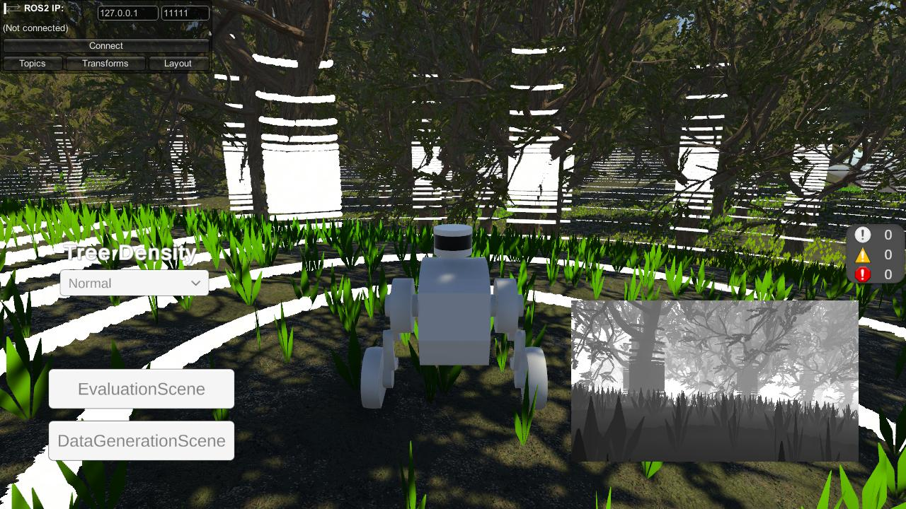

# Documentation

## Core Scripts

- `DataGenerationManager.cs`: Manages the data generation process, including initialization, execution, and control of data sampling rounds. Provides interfaces for starting, stopping, and monitoring data generation.
- `FilePathManager.cs`: Handles the creation and management of file paths for storing generated data, ensuring organized and consistent data output. Supports dynamic path generation based on user or session parameters.
- `GameSettings.cs`: Stores and manages global game settings.
- `GoalPublisher.cs`: Publishes navigation goals to the robot or vehicle, enabling autonomous movement within the simulation. Integrates with ROS for real-time goal updates.
- `ImageSampler.cs`: Samples and saves images from various camera sensors, supporting multiple sensor types and configurations. Handles image capture, formatting, and storage.
- `ScenePointCloudSaver.cs`: Captures and saves the point cloud data of the entire scene, useful for 3D reconstruction, mapping, and analysis. Supports exporting in standard formats.
- `TomlDataManager.cs`: Manages sampled data using TOML files.
- `DiabloControl`: Controls the Diablo vehicle in the simulation, handling movement, input, and interaction with the environment. Supports both manual and automated control modes.

## Example Scenes

|             |              |  |  |
| :----------------------------------------------------------: | :----------------------------------------------------------: | :----------------------------------------------------------: | :----------------------------------------------------------: |

- [DataGenerationScene](Assets/Scenes/DataGenerationScene.unity): Scene for generating training data using various sensors. Includes UI for controlling data generation rounds and sensor parameters.
- [EvaluationScene](Assets/Scenes/EvaluationScene.unity): Scene for evaluating algorithms or models using the generated data. Supports real-time feedback and visualization.
- [MultiSensorDataGenerationScene](Assets/Scenes/MultiSensorDataGenerationScene.unity): Scene for generating data with multiple sensors simultaneously. Useful for multi-modal data collection and sensor fusion research.
- [MultiSensorEvaluationScene](Assets/Scenes/MultiSensorEvaluationScene.unity): Scene for evaluating multi-sensor setups and data fusion algorithms. Includes advanced visualization and analysis tools.

## Sensor Support

- **Adding Sensors**: To add sensors to the scene, drag and drop prefabs from the [UnitySensors Samples](Assets/Samples/UnitySensors/2.0.4/Sample/Prefabs) and [UnitySensorsROS Samples](Assets/Samples/UnitySensorsROS/2.0.4/Sample/Prefabs) folders into your scene. Supported sensors include cameras, LiDARs, IMUs, and more.
- **Sensor Configuration**: After adding a sensor, select it in the `Hierarchy` and configure its parameters in the `Inspector` panel. You can adjust properties such as resolution, field of view, sampling rate, and output format to suit your requirements.
- **TF Support**: Sensors support TF (Transform) data, enabling integration with ROS (Robot Operating System) for real-time data streaming and coordinate transformations.
    - To set up TF, drag and drop the [TFMap](Assets/Samples/UnitySensorsROS/2.0.4/Sample/Prefabs/Utils/TFMap.prefab) prefab into your scene.
    - Add the `TFLink` script to each sensor and configure the `frame_id` and parent-child relationships in the `Inspector`. This ensures correct spatial relationships between sensors and the robot base.
    - Best Practice: Use consistent naming for `frame_id` and maintain a clear parent-child hierarchy for easier debugging and integration with ROS tools.

## Configuration

- **Sensor Parameters**: Each sensor's properties (e.g., resolution, FOV, noise models) can be configured in the Inspector panel.
- **Output Paths**: Data output paths are managed by `FilePathManager.cs` and can be customized to fit your project structure.

## Data Generation

- **Generation Rounds**: The `Data Generation Round` and `Poisson Sampling Round` parameters control how many times the data generation process is executed. These can be adjusted via the UI or in the `DataGenerationManager` script to increase or decrease the amount of generated data. Higher rounds yield more data but may increase simulation time.
- **Camera Sensor**: 
    - Drag and drop the desired camera sensor prefab from the [UnitySensors Samples](Assets/Samples/UnitySensors/2.0.4/Sample/Prefabs) folder into the scene.
    - Add the camera sensor to the `CameraSensorsList` in the `ImageSampler` script to enable image sampling and storage.
    - Tip: Use multiple camera sensors for multi-view or stereo data collection.
- **TOML Fields**:
    - `depthCameraFarClipPlane`: Far clip plane distance for the depth camera.
    - `depthCameraHorizontalFOV`: Horizontal field of view for the depth camera.
    - `dataArray`: Array of data objects containing:
        - `imageFileNameList`: List of image file names.
        - `posStart`: Position of the vehicle
        - `yawStart`: Yaw angle of the vehicle

## Evaluation
- **ROS Connection**: 
    - **Unity Side**: To connect to ROS, configure the correct settings in `Robotics` -> `ROS Settings` in the Unity Editor, such as ROS version, ROS IP address, and port. Ensure the settings match your ROS environment.
    - **ROS Side**: Ensure `ROS-TCP-Endpoint` is running and configured to accept connections from Unity. Use the provided launch files or scripts for easy setup.
    - Troubleshooting: If the connection fails, check firewall settings, IP addresses, and port numbers on both Unity and ROS machines.
- **Visualization**: Drag the `DefaultVisualizationSuite` prefab of the `Visualizations` package into the scene. In play mode, you can visualize the data from the sensors in real-time, including point clouds, images, and trajectories. Use the visualization tools to debug sensor placement and data quality.

For more details, refer to the [ROS-TCP-Connector documentation](https://github.com/Unity-Technologies/ROS-TCP-Connector).