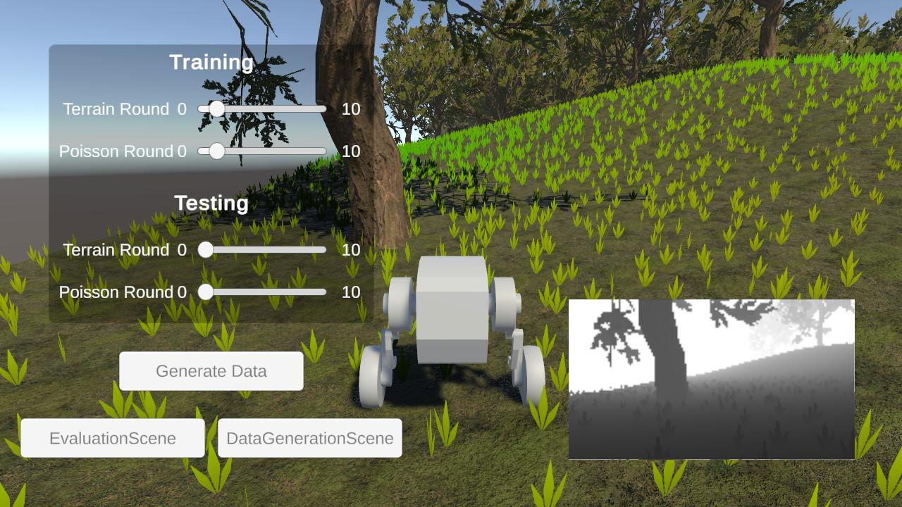
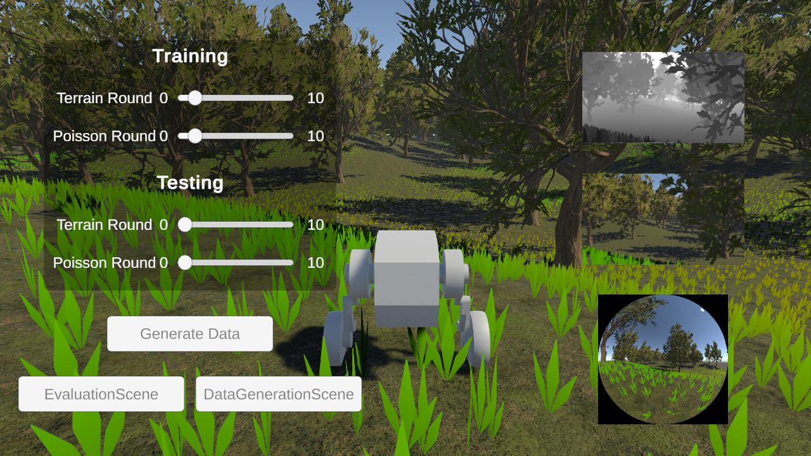
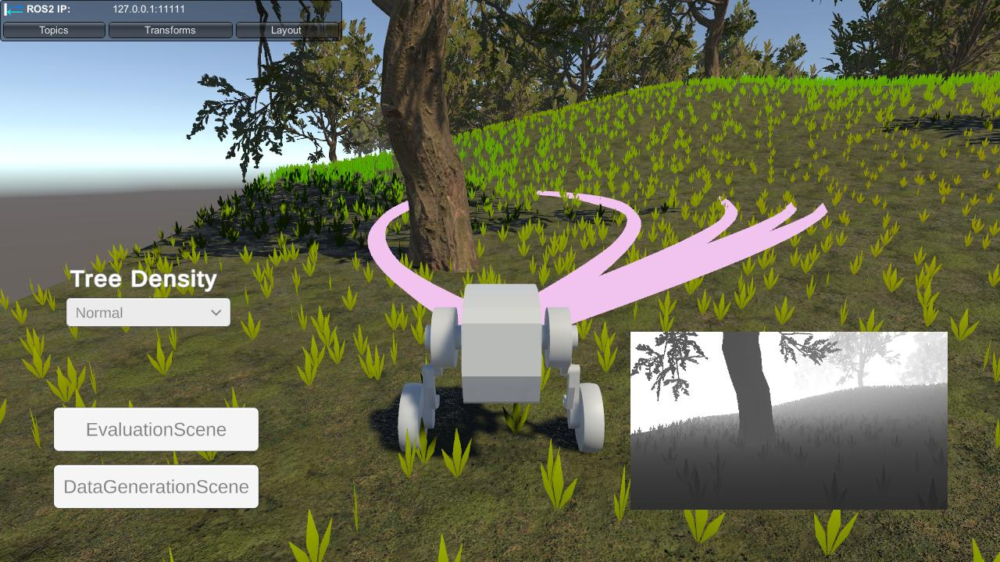
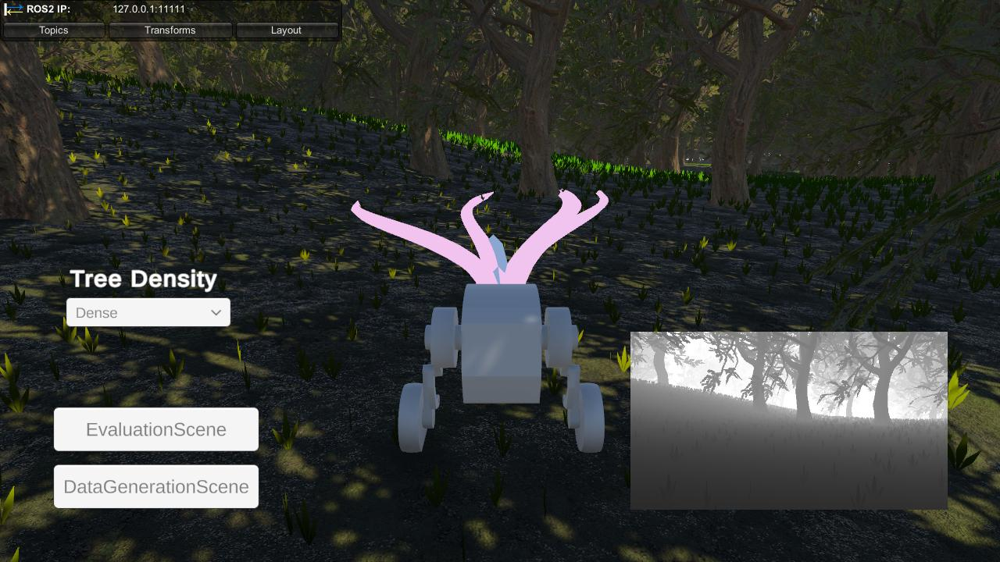

# YOPO-Sim

[](LICENSE)
[](https://unity.com/)
[](CONTRIBUTING.md)
[](https://deepwiki.com/TJU-Aerial-Robotics/VoxelGenerator)

A high-performance, multi-sensor supported off-road environment simulator based on the Unity engine.

## Features
- **Multi-Sensor Support**: Integrates a wide range of sensors, including RGB, depth, and fisheye cameras, as well as LiDAR and IMU.
- **Randomized Environments**: Procedurally generates diverse off-road terrains and vegetation.
- **Data Generation**: Captures comprehensive datasets, including images, vehicle poses, and point cloud maps.
- **ROS Integration**: Seamlessly connects with ROS for real-time data streaming and control.
- **High-Fidelity Simulation**: Provides a realistic simulation environment for robotics research and autonomous vehicle development.

## System Requirements
- **OS**: Windows 10/11, macOS, or Linux
- **Unity Version**: 2022.3 or newer
- **Hardware**: A modern GPU and at least 16 GB of RAM are recommended for optimal performance.

## Quick Start

### Standalone Version

You can download the latest binary version from the [Releases](https://github.com/your-username/YOPO-Sim-WIP/releases) page.

### Editor Version

1. Clone the repository:
   ```bash
   git clone https://github.com/your-username/YOPO-Sim-WIP.git
   ```
2. Install Unity Hub and the required version of Unity (2022 or newer).
   - Download Unity Hub from [Unity's official website](https://unity.com/download).
3. Open the project in Unity Hub.
4. Acquire and import the third-party packages (all are free in the Unity Asset Store):
    - [Vista](https://assetstore.unity.com/packages/p/procedural-terrain-hexmap-vista-personal-edition-297327)
    - [Unity Terrain - URP Demo Scene](https://assetstore.unity.com/packages/p/unity-terrain-urp-demo-scene-213197)
5. Load the scenes:
    - Evaluation scene: `Assets/Scenes/EvaluationScene`
    - Data generation scene: `Assets/Scenes/DataGenerationScene`
6. Run the simulation.

## Scenes

### DataGenerationScene

The `DataGenerationScene` is designed for data acquisition, enabling collection of various types of data for training and testing purposes. It collects data from multiple camera sensors, the pose of the vehicle, and the point cloud map of the environment, saving them in a structured format (TOML).

|  |  |
| :----------------------------: | :---------------------------------------: |

Example output directory structure:
```
TrainingData
└── Scene_0
    ├── Textures
    │   ├── depth_0.exr
    │   ├── fisheye_0.png
    │   └── rgb_0.png
    ├── data.toml
    ├── terrain.ply
    └── tree.ply
```

### EvaluationScene

The `EvaluationScene` is designed for evaluating the performance of the `YOPO-Rally` planner. It provides a simulated environment where the planner can be tested against various terrains and tree densities. Real-time feedback and visualization are supported.

|  |  |
| :-------------------------------: | :-------------------------------: |

## Documentation

For detailed documentation, including core scripts, sensor setup, data generation, and evaluation, please refer to the [Documentation](DOCUMENT.md) file.

## ROS Integration
YOPO-Sim supports full integration with ROS, allowing you to stream sensor data and send control commands in real time. To connect to a ROS network, configure the `ROS-TCP-Connector` settings in the Unity Editor and run the corresponding ROS endpoint.

## Sensor Support

Sensor support is provided by [UnitySensors](https://github.com/Field-Robotics-Japan/UnitySensors):
- RGB Camera
- Depth Camera
- Fisheye Camera (Equidistant and EUCM models)
- LiDAR
- IMU

<!-- Sensor video -->
https://github.com/user-attachments/assets/30a0dbd8-22fe-4592-9f34-5371e3ac14e9

## Randomized Environment

Randomized terrain and vegetation are provided by [Vista](https://assetstore.unity.com/packages/tools/terrain/procedural-terrain-hexmap-vista-personal-edition-297327):
- Procedural terrain
- Randomized trees

<!-- Randomized environment video -->
https://github.com/user-attachments/assets/b92b3cd3-88b8-4fed-8599-bd7ade1459f1

## Point Cloud Map Generation

Point cloud map generation is handled by a separate repository: [VoxelGenerator](https://github.com/TJU-Aerial-Robotics/VoxelGenerator).

<!-- Point Cloud Map Generation -->
https://github.com/user-attachments/assets/25109004-25b0-4515-b65d-24ef552c27fd

## Data Acquisition

YOPO-Sim supports acquisition of:
- Images (RGB, depth, fisheye)
- Vehicle position and orientation
- Point cloud maps

<!-- Data Acquisition -->
https://github.com/user-attachments/assets/418ebe5f-97aa-4e66-9375-4a68926ac15c

## Troubleshooting
- **Missing Packages or Errors**: If you encounter issues with missing packages, try re-importing all assets or restarting Unity Hub.
- **Performance Issues**: To improve performance, lower the simulation resolution, reduce the number of active sensors, or simplify the environment complexity.
- **ROS Connection Problems**: Ensure that the `ROS-TCP-Endpoint` is running and that the IP addresses and port numbers match between your Unity and ROS machines. Check your firewall settings to allow the connection.

## Contributing

Contributions are welcome! Please feel free to submit a pull request. For more details, see [CONTRIBUTING.md](CONTRIBUTING.md).

## Thanks

We would like to express our gratitude to the following projects and creators for their significant contributions:

- **[UnitySensors](https://github.com/Field-Robotics-Japan/UnitySensors)**: For providing the core sensor simulation framework.
- **[ROS-TCP-Connector](https://github.com/Unity-Technologies/ROS-TCP-Connector)**: For enabling seamless integration with ROS for real-time data streaming.
- **[Vista](https://assetstore.unity.com/packages/tools/terrain/procedural-terrain-hexmap-vista-personal-edition-297327)** and **[Unity Terrain - URP Demo Scene](https://assetstore.unity.com/packages/p/unity-terrain-urp-demo-scene-213197)**: For the assets used to generate randomized terrain and vegetation.
- **CodeMonkey's [Kitchen Chaos](https://unitycodemonkey.com/kitchenchaoscourse.php) course**: For providing valuable learning resources and inspiration.
- **[CSPID](https://github.com/w-bonelli/CSPID.git)**: A PID Controller library used for vehicle control in the simulation.
- **[Tomlet](https://github.com/SamboyCoding/Tomlet)**: A TOML parser library used for data management in the simulation.

## Cite

If you use this package in your research or projects, please cite it as follows:

```
@misc{YOPO-Rally,
      title={YOPO-Rally: A Sim-to-Real Single-Stage Planner for Off-Road Terrain}, 
      author={Hongyu Cao and Junjie Lu and Xuewei Zhang and Yulin Hui and Zhiyu Li and Bailing Tian},
      year={2025},
      eprint={2505.18714},
      archivePrefix={arXiv},
      primaryClass={cs.RO},
      url={https://arxiv.org/abs/2505.18714}, 
}
```

## License

This project is licensed under the [Apache-2.0 License](LICENSE).